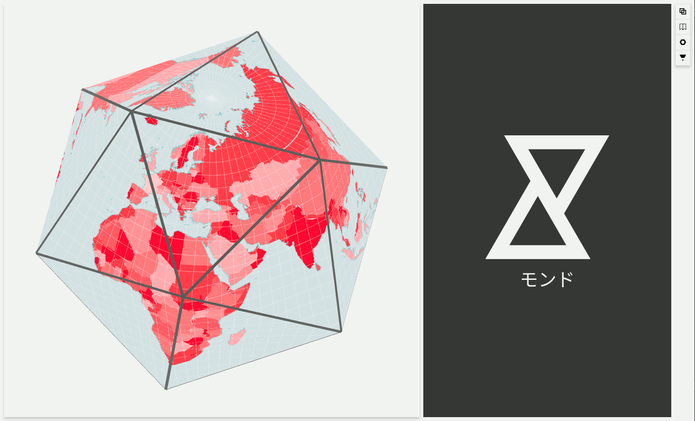

# モンド (mondo)
## Print spatial data on origami



## Data

Supported PostGIS datastore tables with geometries in EPSG:4326.

## Settings

- types
    - pyramid
    - cube
    - spinner
    - icosahedron
    - crane
    - lotus
    - butterfly
    - lily
    - flexicube

- background color: canvas color (not printed)
- print scale ratio: increase size of printed pages (size * ratio)
- print zoom: simplify geometries based on zoom, if empty simplification is not applied
- show graticule: hide/show border around tiles

## Style

Style is an array of style object.
Every object draws data declared in the source param.

`bg` source is the tile background.

```
[
    {
        "source": "bg",
        "fill": "#ffffff"
    },
    {
        "source": "table_name",
        "fill": "#e31111",
        "fill-opacity": 0.5,
        "stroke": "#333333",
        "stroke-opacity": 0.9,
        "stroke-width": 10,
        "stroke-linecap": "round",
        "stroke-linejoin": "round",
        "stroke-dasharray": "50 50"
    }
]

```

How to apply a filter

```
[
    {
        "source": "table_name",
        "filter": [
            [
                [
                    "string_column_name",
                    "=",
                    "value"
                ],
                [
                    "number_column_name",
                    ">",
                    10
                ],
            ],
            [
                [
                    "string_column_name",
                    "=",
                    "different value"
                ]            
            ]
        ],
        "fill": "#e31111"
    }
]


```

filter above translates to

`(string_column_name = 'value' AND number_column_name > 10) OR string_column_name = 'different value'`

filter operators

- `=` equal
- `!=` not equal
- `>` greater than
- `<` less than
- `>=` equal and grater than
- `<=` equal and less than

How to apply an array of values.

```
[
    {
        "source": "table_name",
        "fill": [
            "#ffffff",
            ["number_column_name", "=", 1, "#bce5f4"],
            ["number_column_name", "=", 2, "#ffd0d0"],
            ["number_column_name", "=", 3, "#cbcbcb"],
            ["number_column_name", "=", 4, "#e8e8e8"],
            ["number_column_name", "=", 5, "#e6e6e6"],
            ["number_column_name", "=", 6, "#d3d3d3"],
            ["number_column_name", "=", 7, "#cfcfcf"]
        ]
    }
]
```
structure:

`property: [defaultValue, [...filter, value], ... ]`

supported for
- fill
- stroke
- stroke-width
- stroke-linecap
- stroke-linejoin

How to style wind data. (experimental)
Wind data has to be a point layer.

```
[
    {
        "source": "table_wind_name",
        "type": "wind",
        "stroke": [
            "#ff2c2c",
            "#83f81e"
        ],
        "stroke-opacity": 0.8,
        "stroke-width": 3,
        "speed": 2,
        "max-time": 25000,
        "u": "u_column_name",
        "v": "v_column_name",
        "min-u": "min_u_column_name",
        "max-u": max_u_column_name,
        "min-v": "min_v_column_name",
        "max-v": max_v_column_name,
    }
]
```
`min-u`, `max-u`, `min-v` and `max-v` could be numbers.
`max-time` in milliseconds is only for print.

## Development

- install modules

```
npm install
```

---
- start development
```
npm run watch

npm start
```
---
- environment

```
node v8.9.3
npm v5.5.1
psql v9.5.14
postgis v2.4.2
```